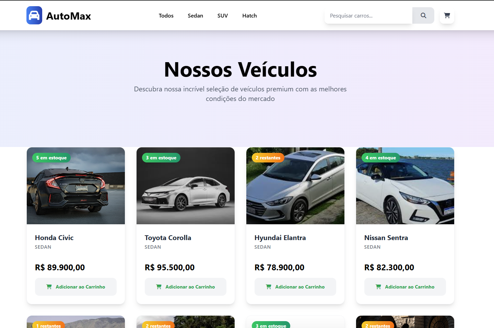
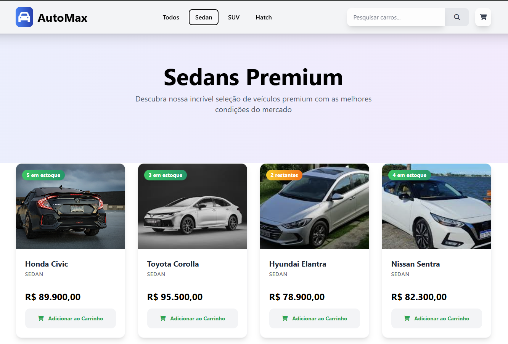
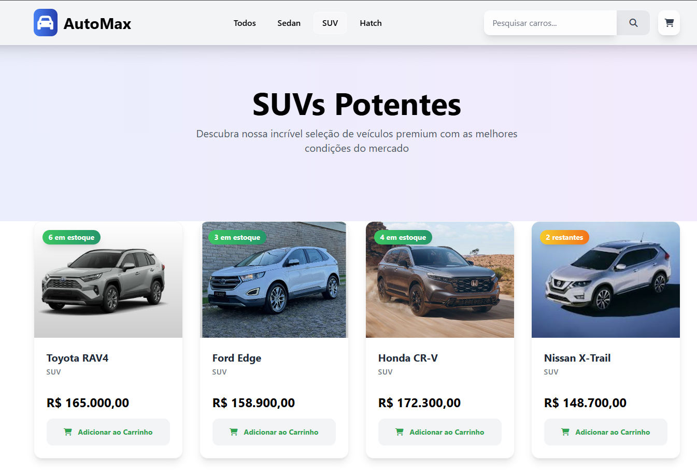
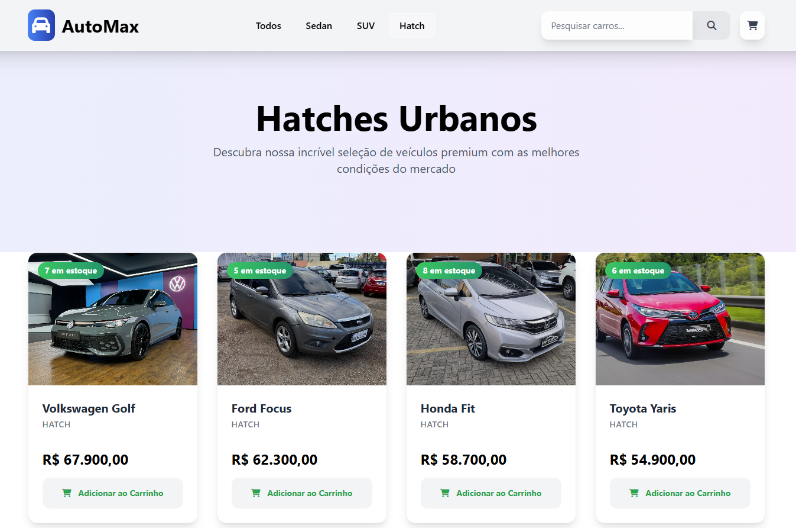
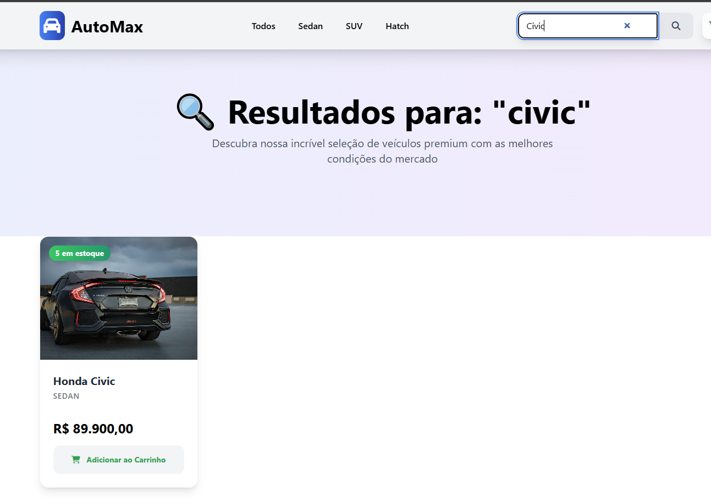
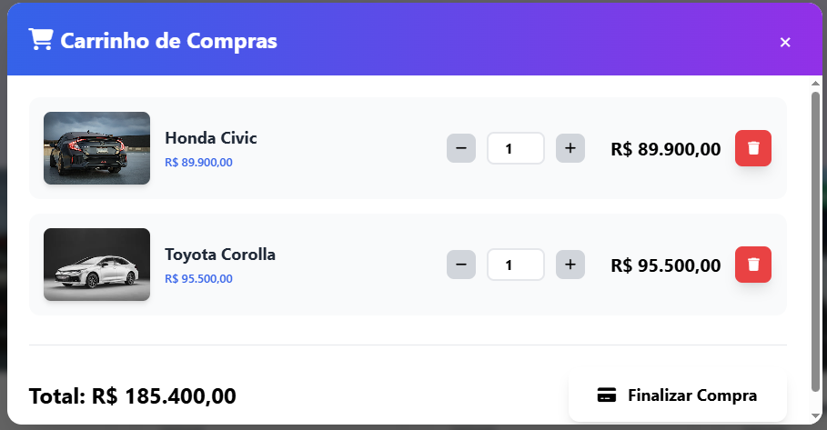
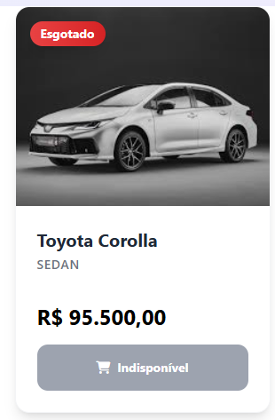

# 🚗 AutoMax - Concessionária Online

Uma aplicação web moderna e responsiva para concessionária de veículos, desenvolvida com HTML5, CSS3, JavaScript e Tailwind CSS. O sistema oferece uma experiência completa de navegação, busca e compra de veículos com interface elegante e funcionalidades avançadas.

## 📋 Índice

- [Características](#-características)
- [Tecnologias Utilizadas](#-tecnologias-utilizadas)
- [Estrutura do Projeto](#-estrutura-do-projeto)
- [Instalação e Configuração](#-instalação-e-configuração)
- [Como Usar](#-como-usar)
- [Funcionalidades](#-funcionalidades)
- [Screenshots](#-screenshots)
- [Estrutura de Dados](#-estrutura-de-dados)
- [Customização](#-customização)
- [Contribuição](#-contribuição)
- [Licença](#-licença)

## ✨ Características

- 🎨 **Design Moderno**: Interface elegante com gradientes, animações e efeitos visuais
- 📱 **Totalmente Responsivo**: Adaptável para desktop, tablet e mobile
- 🔍 **Sistema de Busca**: Pesquisa inteligente por nome e categoria
- 📂 **Filtros por Categoria**: Sedan, SUV e Hatch
- 🛒 **Carrinho de Compras**: Sistema completo com controle de estoque
- 📊 **Controle de Estoque**: Badges visuais e validação em tempo real
- ⚡ **Performance Otimizada**: Carregamento rápido e animações suaves
- 🎯 **UX Intuitiva**: Navegação simples e experiência do usuário aprimorada

## 🛠 Tecnologias Utilizadas

- **HTML5**: Estrutura semântica
- **CSS3**: Estilização avançada com Flexbox/Grid
- **JavaScript (ES6+)**: Lógica da aplicação e interatividade
- **Tailwind CSS**: Framework CSS utilitário
- **Font Awesome**: Ícones vetoriais
- **Google Fonts**: Tipografia (Inter)

## 📁 Estrutura do Projeto

```
automax/
├── index.html              # Página principal
├── script.js               # Lógica da aplicação
├── style.css               # Estilos customizados
├── README.md               # Documentação
└── assets/
    └── images/             # Imagens dos veículos
        ├── honda-civic.jpg
        ├── corolla.jpg
        ├── RAV4.jpg
        └── ... (outras imagens)
```

## 🚀 Instalação e Configuração

### Pré-requisitos

- Navegador web moderno (Chrome, Firefox, Safari, Edge)
- Servidor web local (opcional, para desenvolvimento)

### Passos de Instalação

1. **Clone ou baixe o projeto**

   ```bash
   git clone https://github.com/MatheusCitadini/AutoMax---Projeto-Devs2Blu.git
   cd AutoMax---Projeto-Devs2Blu
   ```

2. **Organize as imagens**

   - Crie a pasta `assets/images/`
   - Adicione as imagens dos veículos conforme nomes no `script.js`

3. **Execute o projeto**
   - Abra `index.html` diretamente no navegador, ou
   - Use um servidor local:

## 📖 Como Usar

### Navegação Principal

1. **Página Inicial**: Exibe todos os veículos disponíveis
2. **Filtros de Categoria**: Use os botões no cabeçalho para filtrar por tipo
3. **Busca**: Digite no campo de pesquisa para encontrar veículos específicos
4. **Carrinho**: Clique no ícone do carrinho para ver itens selecionados

### Adicionando Produtos ao Carrinho

1. Navegue pelos produtos ou use filtros/busca
2. Clique em "Adicionar ao Carrinho" no produto desejado
3. O badge do carrinho será atualizado automaticamente
4. Produtos esgotados ficarão indisponíveis

### Gerenciando o Carrinho

1. Clique no ícone do carrinho para abrir o modal
2. Ajuste quantidades usando os botões + e -
3. Remova itens clicando no ícone da lixeira
4. Finalize a compra clicando em "Finalizar Compra"

### Atalhos de Teclado

- `Ctrl + K`: Foco no campo de busca
- `Escape`: Fechar modal do carrinho

## 🎯 Funcionalidades

### Sistema de Estoque

- **Badges Visuais**:
  - 🟢 Verde: Estoque normal (3+ unidades)
  - 🟡 Amarelo: Estoque baixo (1-2 unidades)
  - 🔴 Vermelho: Esgotado (0 unidades)

### Carrinho de Compras

- Adição/remoção de produtos
- Controle de quantidade
- Validação de estoque
- Cálculo automático de totais
- Persistência durante a sessão

### Filtros e Busca

- Filtro por categoria (Sedan, SUV, Hatch)
- Busca por nome do veículo
- Busca por categoria
- Resultados em tempo real

## 📸 Screenshots

### Página Principal



### Filtro por Categoria





### Sistema de Busca



### Carrinho de Compras



### Produto Esgotado



### Versão Mobile


## 📊 Estrutura de Dados

### Produto

```javascript
{
  id: 1,                              // ID único
  nome: "Honda Civic",                // Nome do veículo
  imagem: "./assets/images/civic.jpg", // Caminho da imagem
  quantidade: 5,                      // Estoque disponível
  categoria: "sedan",                 // Categoria (sedan/suv/hatch)
  valor: 89900                        // Preço em centavos
}
```

### Item do Carrinho

```javascript
{
  ...produto,                         // Dados do produto
  quantidadeCarrinho: 2              // Quantidade no carrinho
}
```

## 🎨 Customização

### Adicionando Novos Produtos

1. Abra `script.js`
2. Adicione um novo objeto no array `produtos`:
   ```javascript
   {
     id: 31, // Próximo ID disponível
     nome: "Novo Veículo",
     imagem: "./assets/images/novo-veiculo.jpg",
     quantidade: 10,
     categoria: "sedan", // sedan, suv ou hatch
     valor: 75000
   }
   ```

### Modificando Cores e Estilos

1. **Cores principais**: Edite as classes Tailwind no `index.html`
2. **Gradientes**: Modifique no `style.css` a classe `.gradient-text`
3. **Animações**: Ajuste as configurações no `tailwind.config`

### Adicionando Novas Categorias

1. Adicione nova categoria nos produtos
2. Crie botão de filtro no HTML
3. Adicione mapeamento na função `filtrarCategoria()`

## 🤝 Contribuição

1. Faça um fork do projeto
2. Crie uma branch para sua feature (`git checkout -b feature/nova-feature`)
3. Commit suas mudanças (`git commit -am 'Adiciona nova feature'`)
4. Push para a branch (`git push origin feature/nova-feature`)
5. Abra um Pull Request

### Padrões de Desenvolvimento

- Use ES6+ para JavaScript
- Teste em diferentes navegadores
- Mantenha responsividade
- Siga convenções de nomenclatura

## 🐛 Problemas Conhecidos

- Imagens grandes podem afetar performance inicial
- Dados não persistem após reload

---

**Desenvolvido por Matheus Citadini**

⭐ Se este projeto foi útil, considere dar uma estrela no GitHub!
